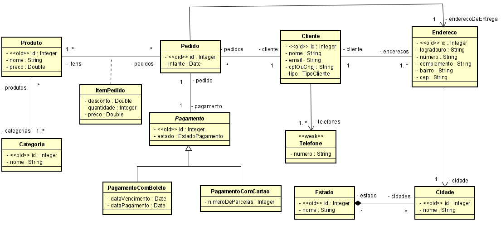

# ProjetoMC

> Desenvolvido por Elias Aguiar

## Executando a aplicação

Execute o seguinte comando no terminal:

```bash
	./mvnw spring-boot:run
```

## Modelo 


## Postman

Se você desejar testar os endpoints, você pode importar a coleção do postman encontrada [aqui](docs/postman.json).